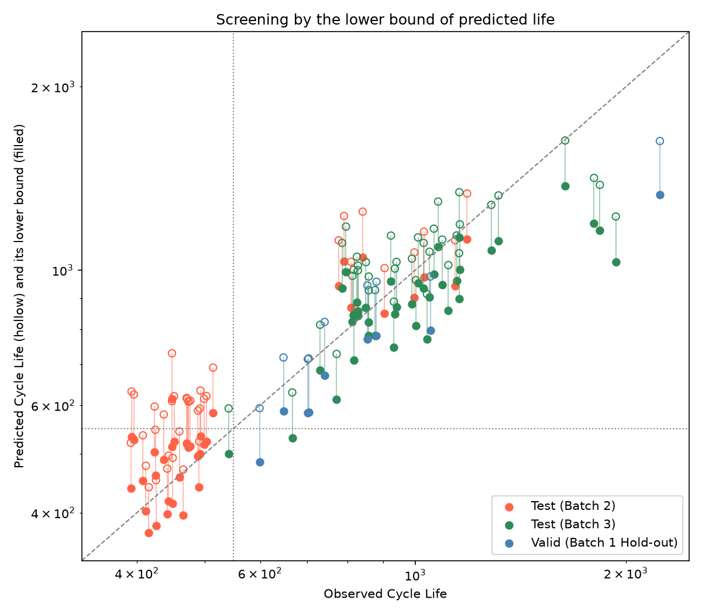

# 문제 해석

### Regression - 배터리 수명 예측

- 초기 100 사이클 데이터만으로 배터리의 총 수명(EOL 까지의 사이클 수) 예측
- 데이터 : 초기 100 사이클
- Target : `cycle_life` - EOL(80% SOH 도달)까지의 총 사이클 수
- 원논문 성능 : 테스트 오차 9.1%

### Classification - 배터리 수명 분류 (Binary)

- 단 5 사이클만으로 배터리의 장/단 수명을 즉시 선별 → 제조 직후 빠른 스크리닝 목표
- 데이터 : 초기 5 사이클
- Target : `cycle_life` 이진화한 파생 변수로 정의
  ```python
  # cycle_life 기준 550사이클로 이진 레이블 생성
  df['label'] = (df['cycle_life'] >= 550).astype(int)
  # 1 = 장수명(Long-life), 0 = 단수명(Short-life)
  ```
- 원논문 성능 : 테스트 오차 4.9% (1-Accuracy)

## 문제 선택 : Regression

논문 내용, 문제 배경상황 등을 고려해서 알아서 채워줘

# 데이터셋 소개

### 3.1 데이터 배치

| 파일 식별명            | 배치    | 자료상 크기 | 사용 범위                                         |
| ---------------------- | ------- | ----------- | ------------------------------------------------- |
| `2017-05-12`           | Batch 1 | 약 2.8 GB   | EDA, 모델 학습 및 내부 검증                       |
| `2018-02-20`           | Batch 2 | 약 1.9 GB   | EDA, 필수 최종 테스트                             |
| `2018-04-12`           | Batch 3 | 약 3.0 GB   | EDA, 추가 테스트                                  |
| `2018-04-03 varcharge` | Extra   | 약 0.1 GB   | 별도 충전 최적화 연구 데이터; 기본 과제 대상 아님 |

원 논문이랑 다른 점에 대해 간단하게 서술해줘.

### 3.2 주요 데이터 필드

| 범위                 | 필드                                       | 용도                                                       |
| -------------------- | ------------------------------------------ | ---------------------------------------------------------- |
| 셀                   | `cycle_life`, 충전 프로토콜                | 타깃, 실험 조건                                            |
| 사이클 요약          | `QDischarge`, `QCharge`                    | 방전·충전 용량과 초기 변화                                 |
| 사이클 요약          | `IR`, `Tmax`, `Tavg`, `Tmin`, `chargetime` | 저항·온도·충전 시간 특성                                   |
| 가이드의 사이클 요약 | `discharge_time`                           | 방전 시간; 가이드에는 있으나 원본 파일의 summary 에는 없어 사용하지 않음 |
| 사이클 상세          | `t`, `V`, `I`, `T`, `Qc`, `Qd`             | 시간에 따른 전압·전류·온도·용량                            |
| 보간 곡선            | `Qdlin`                                    | 전압 축으로 보간된 방전 용량; ΔQ(V) 계산                   |
| 보간 곡선            | `Tdlin`, `discharge_dQdV`                  | 온도 곡선, 방전 용량의 전압 미분 특성                      |

`Qdlin`은 방전 용량을 전압 1,000개 지점에 맞춰 보간한 값이다. 가이드에는 2–3.6 V 로 적혀 있으나, 파일의 전압 축(`Vdlin`)을 확인하면 3.5 V 에서 2.0 V 로 내려가는 순서다. 코드에서는 `QDischarge`, `QCharge`를 `QD`, `QC`로 줄여 쓴다.

# EDA

## 전처리

- 전처리 어떻게 했는지.
- 이상치는 어떻게 특정했으며 어떤 것들을 남겼는지

## Feature Engineering

도메인 지식이나 통계 같은 걸 바탕으로 feature 확인

- 기존 feature들 중 어떤 건 필요 없어서 빼야할 거 같더라
- 기존 feature들 중 select한 건 이런 것들인데 이런이런 근거로 select 했다.

- 기존 진행한 EDA : Cycle Life 분포, 열화 곡선 분석, ΔQ(V) 곡선 분석, 충전 속도(C-rate)와 수명의 관계, feature들 상관관계(다중공선성 확인)

# Modeling

- feature engineering 하고 EDA 내용 바탕으로 후보 모델 골라서 돌려보고 결과 확인.
- 가장 잘 나온 결과를 baseline 삼아 가설 세우고 해당 가설이 맞는지 확인해보기 + 결과 정리하기
- 최종 결론
  - 모델은 뭘 썼다
  - 결과는 원논문 결과에 비해 이렇게 나왔지만 원논문과 데이터셋이 다르기 때문에 비교하기가 애매하다 (만약 시간이 되고, 논문 구현이 된다면 논문에서 사용한 기법을 그냥 여기서 진행해보고 결과 비교해봐도 되지 않을까)
  - 해당 결론이 도메인적으로 가지는 의미?

- 추가 실험(Classification)
  - 추가로 앞 문제 정의에서 언급했듯 우리가 어떤 이유로 Classification도 필요한데 다만 주어진 문제와는 달리 cycle 100을 기준으로 분류도 진행해보았다.
  - 예시 문장 : 선별·등급 분류처럼 정확한 수명 값보다 빠른 판단이 필요한 용도를 위해 분류 관점의 결과를 함께 제시했다. (논문에 있는 내용 인용하던가 해서 하기)

  - 학습 데이터셋(Batch 1) 특성 상 단수명 셀이 41개 중 1개(수명 534)뿐인 상태.
  - zero-shot으로 접근해서 문제를 풀어보았다.
  - 최종적으로 이런 모델을 썼는데 이런 결과가 나왔다.
  - 해당 결론이 도메인적으로 가지는 의미

### 피처 엔지니어링 전략

- 기존 feature들을 바탕으로 어떤 것들을 살펴봤더니 '어떤 것들이 있으면 좋겠더라'

피처는 초기 100 사이클 안에서 계산할 수 있고, 배치가 바뀌어도 수명과의 관계가 유지되는 것을 기준으로 골랐다.

| 구분      | 피처                                             | EDA 근거                                                            |
| --------- | ------------------------------------------------ | ------------------------------------------------------------------- |
| 핵심      | log10(ΔQ(V) 분산)                                | 세 배치 모두에서 수명과 강한 상관                                   |
| 보조 후보 | 충전 시간, 평균 온도, 초기 용량 변화             | Batch 1 에서 상관이 있으나 배치 간에 불안정. 검증 후 채택하기로 함  |
| 제외      | 충전 정책명, 용량의 절대 수준, ΔQ(V) 최솟값·평균 | 배치 간에 겹치지 않거나, 배치 차이가 그대로 들어가거나, 분산과 중복 |

누수를 막기 위해 피처 함수는 초기 100 사이클로 잘라낸 데이터만 입력으로 받는다. 내부저항 변화는 Batch 2 의 6개 셀에 측정값이 없어 후보에서 뺐다.

### 모델 선택 및 근거

- 후보 모델 : 단일 피처 선형 회귀, 보조 피처를 더한 선형 회귀, Ridge, Elastic Net, Random Forest, Gradient Boosting
- 최종 모델 : **단일 피처 선형 회귀.** log10(수명) = a × log10(ΔQ(V) 분산) + b
- 선택 이유 :
  - 로그-로그에서 직선 관계가 확인됐다 (EDA 상관 -0.94).
  - 보조 피처나 복잡한 모델을 써도 교차검증 오차가 표준오차 이상으로 줄지 않았다 (9.10 ~ 11.03 vs 9.28).
  - 학습 셀이 41개뿐이고, Batch 2 는 학습 범위 밖의 수명을 예측해야 한다. 직선을 연장할 수 있는 선형 모델이 맞다. 실제로 Batch 2 에서 트리 계열은 28.9 ~ 32.7%로 선형(26.2%)보다 나빴다.

모델 선택은 Batch 1 의 교차검증 점수만으로 했다. Batch 1 을 셀 단위로 Train 32개와 Hold-out 9개로 나누고, Train 안에서 5-fold 교차검증을 10회 반복했다.

## 성능 결과

| 구분                     | MAPE (%) | 비고                           |
| ------------------------ | -------- | ------------------------------ |
| Train (Batch 1 CV)       | 9.28     |                                |
| Valid (Batch 1 Hold-out) | 8.87     |                                |
| Test (Batch 2)           | 26.17    |                                |
| Gap (Train-Valid)        | -0.41    | (+) : 과적합 의심              |
| Gap (Valid-Test)         | 17.30    | (+) : 배치간 일반화 저하 의심  |
| Gap (Target-Test)        | 17.07    | Target : 원논문 9.1%           |
| Test (Batch 3)           | 13.25    |                                |
| Gap (Batch2-Batch3)      | -12.92   | Test 성능 간 비교              |
| Gap (Target-Test)        | 4.15     | Batch 3 기준, 원논문 성능 비교 |

Gap 은 "뒤 단계 − 앞 단계"로 계산했다. 양수면 뒤 단계에서 성능이 나빠진 것이다.

- **Train - Valid (-0.41)** : 과적합이 없다. 분할을 20번 바꿔도 CV 9.32 ± 0.69, Valid 9.28 ± 2.19로 같은 수준이다.
- **Valid - Test (+17.30)** : 배치 간 일반화가 크게 떨어진다. 원인은 아래 오류 분석의 "배치 수준의 편향"이다.
- **Target - Test (+17.07)** : 원논문 수치와는 평가 조건이 다르다. 원논문은 두 배치를 섞어 학습했고, 이 데이터셋의 Batch 2(2018-02-20)는 원논문에 없는 배치다. 9.1%는 피처 9개를 쓴 모델의 값이다. 같은 구성(ΔQ 분산 하나)의 원논문 모델은 Batch 3 와 같은 배치에서 11.4%를 보고했고, 이 모델은 13.25%다.

**부가 결과 : 예측 수명으로 장·단수명 분류 (550 사이클 기준).**

| 평가 대상 | 장수명 / 단수명 | Accuracy | F1 (장수명) | AUC   |
| --------- | --------------- | -------- | ----------- | ----- |
| Batch 2   | 9 / 30          | 0.538    | 0.500       | 1.000 |
| Batch 3   | 39 / 1          | 0.975    | 0.987       | 1.000 |

학습 데이터에 단수명 셀이 1개뿐이어서 분류 모델을 직접 학습할 수 없었다. 대신 회귀 모델의 예측 수명으로 판정했다. 입력이 초기 100 사이클이므로 원논문의 분류 실험(초기 5 사이클)과는 조건이 다르다. AUC 가 1.00이라는 것은 예측 수명 순으로 줄을 세우면 단수명 셀이 빠짐없이 앞에 온다는 뜻이다. Accuracy 가 낮은 것은 순서가 아니라 기준선의 위치가 어긋났기 때문이다.

**추가 실험 : 예측 하한으로 판정.** 기준선 문제를 풀기 위해 zero-shot 학습과 이상 탐지 문헌의 기법을 적용했다. 예측 수명 그대로가 아니라 **예측의 하한**(conformal prediction, 수준 90%)이 550 미만이면 단수명으로 판정한다. 하한의 여유는 Batch 1 의 leave-one-out 잔차로만 정했다.

| 평가 대상               | Accuracy | F1 (장수명) | F1 (단수명) | 단수명 검출률 | 오경보율 |
| ----------------------- | -------- | ----------- | ----------- | ------------- | -------- |
| Batch 1 (leave-one-out) | 0.875    | 0.931       | 0.333       | 1.000         | 0.129    |
| Batch 2                 | 0.949    | 0.900       | 0.966       | 0.933         | 0.000    |
| Batch 3                 | 0.975    | 0.987       | 0.667       | 1.000         | 0.026    |

Batch 2 의 단수명 셀 30개 중 28개를 라벨 없이 가려냈다. 대가로 Batch 1 내부에서 장수명 셀의 13%를 단수명으로 판정한다. One-class 이상 탐지(Mahalanobis, Isolation Forest, One-Class SVM, LOF)도 시도했으나, 수명이 아니라 배치 차이를 이상으로 잡아 실패했다. 이 실험은 테스트 결과를 본 뒤에 추가한 것이고 수준 90%도 그 뒤에 확정했으므로, 위 성능 표와 같은 무게로 읽으면 안 된다. 자세한 내용은 [DAY2_MODELING.md](DAY2_MODELING.md) 9절에 있다.




## 오류 분석

**모델이 가장 크게 틀린 셀의 공통점.**

- **Batch 2 는 39개 중 38개를 실제보다 길게 예측했다.** 오차가 가장 큰 셀은 449 -> 730(62.7%), 393 -> 632(60.9%)다. 특정 셀이 아니라 배치 전체가 같은 방향으로 틀렸다.
- **수명이 1,800 이상인 셀은 짧게 예측했다.** Batch 1 Hold-out 2237 -> 1629, Batch 3 1935 -> 1225. 수명이 매우 긴 셀은 초기 100 사이클의 ΔQ(V) 가 측정 노이즈 수준이어서 구분되지 않는다.

**원인 가설과 검증.** 테스트 결과를 본 뒤의 분석이므로 위 성능 표에는 반영하지 않았다.

| 가설                                           | 결과                                                                                  | 판정 |
| ---------------------------------------------- | ------------------------------------------------------------------------------------- | ---- |
| Batch 2 의 오차는 배치 전체의 일정한 편향이다  | 예측 / 실제가 Batch 2 1.23 ~ 1.26배, Batch 3 1.05배. 편향을 제거하면 MAPE 9.5 ~ 14.1% | 채택 |
| ΔQ(V) 의 기준 사이클을 바꾸면 편향이 줄어든다  | cycle 3 ~ 40 어느 것을 써도 1.21 ~ 1.25배                                             | 기각 |
| 초기 용량 상승폭을 더하면 배치 차이가 설명된다 | Batch 2 는 21.6%로 좋아지나 Batch 3 가 21.9%로 나빠짐                                 | 기각 |
| 초기 용량의 절대 수준을 더하면 성능이 오른다   | Batch 1 CV 는 6.87로 가장 좋으나 Batch 2 가 44.8%로 나빠짐                            | 기각 |

Batch 2 는 같은 ΔQ(V) 분산에서 수명이 약 20% 짧다. 아래 그림에서 Batch 2 의 점들이 Batch 1 의 회귀선 아래에 평행하게 놓여 있다. 학습 배치가 하나뿐이면 이런 배치 간 차이를 데이터에서 배울 수 없다.


마지막 가설은 EDA 의 판단을 뒷받침한다. EDA 에서 "용량의 절대 수준은 배치마다 달라 피처로 쓰면 안 된다"고 보고 제외했는데, 교차검증 점수만 보고 골랐다면 이 피처가 선택되어 Batch 2 오차가 26%에서 45%로 커졌을 것이다.

**개선 방향.**

- **기준선 보정.** 새 배치에서 수명이 확인된 셀 몇 개로 예측의 절편만 보정하면 Batch 2 의 MAPE 가 1개로 15.0%, 3개로 12.5%, 5개로 11.8%가 된다. 분류 정확도는 5개로 0.951이다.
- **여러 배치로 학습.** 조건이 다른 배치를 함께 학습해야 배치 간 차이를 모델이 배울 수 있다.
- **장수 셀.** 관측 기간을 100 사이클보다 늘리면 변화가 작은 셀도 구분할 수 있다.

## ESS 도메인 해석

**어떤 의사결정에 활용할 수 있는가.**

- **셀 선별과 팩 구성.** 초기 100 사이클만 돌려 보면 어느 셀이 먼저 수명을 다할지 순서를 알 수 있다. 수명이 비슷한 셀끼리 묶거나 하위 셀을 걸러낼 수 있다.
- **교체 계획.** 같은 조건에서 수집한 데이터로 학습했다면 수명을 약 9% 오차로 예측한다. 예기치 못한 설비 중단과 불필요한 조기 교체를 줄이는 근거가 된다.

## 참고문헌

- Severson et al. (2019). Data-driven prediction of battery cycle life before capacity degradation. _Nature Energy_, 4, 383–391.

## 팀 구성

- 강지수 : EDA, 피처 엔지니어링, 모델 개발, 성능 평가(Batch 2, Batch 3)
