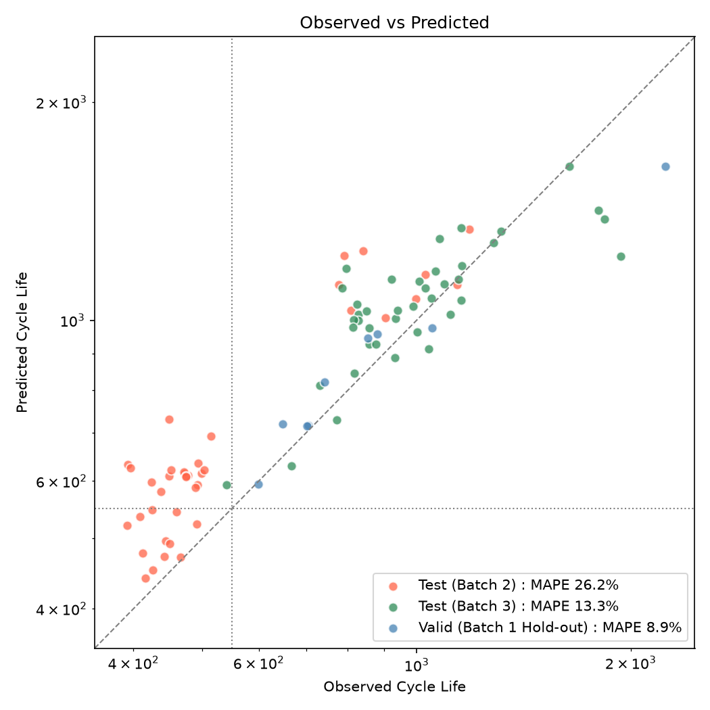
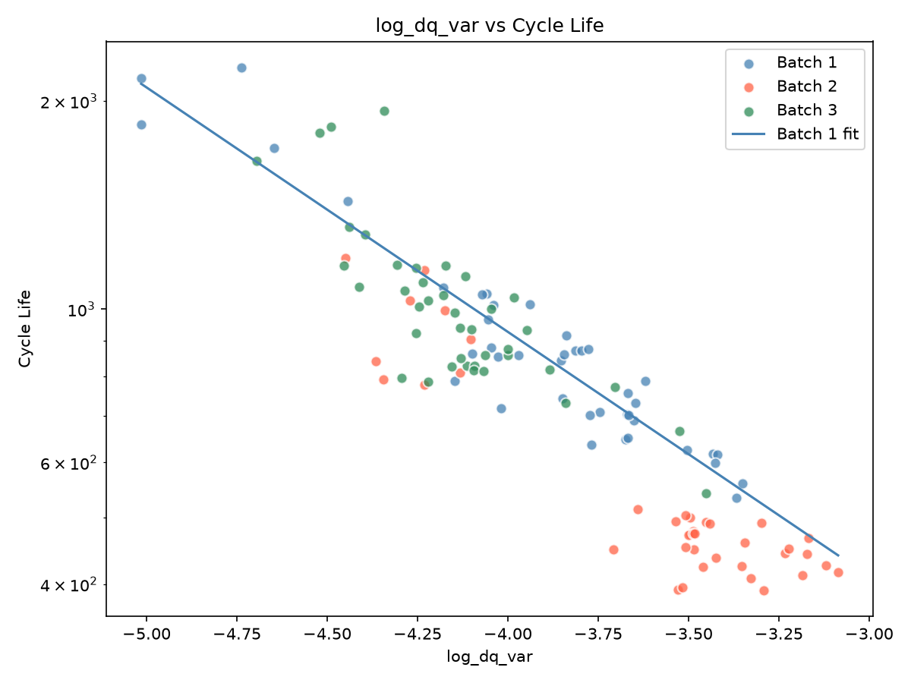

# ESS 배터리 수명 예측

배터리 셀의 **초기 100 사이클 측정값만으로** 그 셀의 총 수명(cycle life)을 예측한다. 수명을 미리 알면 팩을 구성할 때 셀을 선별하고, 교체 시점을 계획할 수 있다.

## 프로젝트 개요

- 데이터셋 : MIT-Stanford Battery Dataset (Severson et al., Nature Energy 2019)
- 학습 데이터 : Batch 1 (2017-05-12), 41개 셀
- 평가 데이터 : Batch 2 (2018-02-20), 39개 셀
- 추가 평가 : Batch 3 (2018-04-12), 40개 셀
- 태스크 : **Regression** (Cycle Life 예측). 예측 수명을 550 사이클 기준으로 나눈 장·단수명 분류를 부가 결과로 함께 보고한다

## 파일 구조

```text
├── data/
│   └── README.md               데이터 출처와 배치 구성
├── docs/
│   ├── README.md               이 문서
│   ├── MODEL_STRATEGY.md       DAY 1 모델 설계 전략
│   └── DAY2_MODELING.md        DAY 2 모델 개발 기록 (가설과 검증 과정)
├── notebooks/
│   └── 30-ESSHealth-scratch.ipynb   EDA
├── src/
│   ├── config.py               경로, 배치별 품질 처리 규칙, 과제 기준 상수
│   ├── preprocess.py           원본 로딩과 정제
│   ├── features.py             초기 사이클 피처
│   ├── models.py               후보 모델
│   ├── evaluation.py           분할, 교차검증, 지표, 모델 선택
│   ├── report.py               리포팅 표와 그림
│   ├── train.py                공식 실험 파이프라인
│   └── analysis.py             사후 분석
├── tests/
│   └── test_pipeline.py
├── results/
│   ├── model_performance.csv   성능 결과 (리포팅 포맷)
│   ├── model_comparison.csv    후보 모델 비교
│   ├── classification.csv      550 사이클 기준 분류 성능
│   ├── predictions.csv         셀별 예측
│   ├── posthoc_*.csv           사후 분석
│   └── figures/
├── requirements.txt
└── README.md
```

## 환경 설정

```bash
git clone https://github.com/kjsoo-1010/ess-mini-project
cd ess-mini-project
pip install -r requirements.txt     # 또는 uv sync

python -m src.train                 # 학습과 평가. 결과는 results/ 에 저장
python -m src.analysis              # 사후 분석
python -m pytest                    # 테스트
```

데이터(약 5 GB)는 처음 실행할 때 kagglehub 가 자동으로 내려받는다. 이미 받은 파일이 있으면 `ESS_DATA_DIR` 환경변수로 위치를 지정한다. 자세한 내용은 [data/README.md](../data/README.md)에 있다.

## EDA

분석 대상은 품질 처리 후의 120개 셀이다. 수명을 알 수 없는 셀을 제외했고(Batch 1 5개, Batch 2 8개, Batch 3 6개), Batch 1 의 5개 셀은 원논문 공식 코드에 따라 수명을 보정했다. EOL 은 공칭 용량 1.1 Ah 의 80%인 0.88 Ah 다.

### Cycle Life 분포

- 수명 중앙값은 Batch 1 842, Batch 2 472, Batch 3 964.5로 배치마다 다르다. 세 배치 모두 오른쪽으로 긴 꼬리를 가진다.
- 단수명(<500) 비율은 Batch 1 0%, Batch 2 72%, Batch 3 0%다. 장수명(>1,000)은 24%, 8%, 48%다.
- 핵심 발견 : **학습 배치와 테스트 배치의 수명 분포가 겹치지 않는다.** Batch 2 셀의 77%가 Batch 1 의 최솟값(534)보다 짧다.

### 열화 곡선 분석

- 용량은 1.05 ~ 1.10 Ah 에서 시작해 오랫동안 평탄하다가 말기에 급락한다. 수명 전반부 50% 동안의 감소는 전체의 3 ~ 10%뿐이다.
- Knee point 는 세 배치 모두 수명의 82 ~ 87% 지점에서 나타난다. Knee 와 수명의 상관계수는 0.986이다.
- 핵심 발견 : **수명은 knee 가 언제 시작되느냐로 결정되는데, 초기 100 사이클의 용량 곡선에는 그 신호가 없다.**

### ΔQ(V) 곡선 분석

- ΔQ(V) = Q100(V) − Q10(V). cycle 100 과 cycle 10 의 방전 용량-전압 곡선의 차이다.
- 단수명 셀은 곡선이 깊게 내려가고(최솟값 중앙값 -0.056 Ah), 장수명 셀은 0 근처에 머문다(-0.022 Ah).
- 핵심 발견 : **log(ΔQ 분산)과 log(수명)의 상관계수가 Batch 1 -0.94, Batch 2 -0.92, Batch 3 -0.80이다.** 용량 값으로는 구분되지 않던 셀이 전압 곡선의 변화로는 구분된다.

### 충전 속도(C-rate)와 수명의 관계

- Batch 1 에서는 충전이 빠를수록 수명이 짧다. 80%까지의 충전 시간과 수명의 상관계수는 0.79다.
- Batch 2 와 3 은 모든 정책의 충전 시간이 약 10분으로 같다. 그런데 수명은 392 ~ 1935로 크게 다르다.
- 핵심 발견 : **충전 조건은 한 배치 안에서는 수명을 잘 설명하지만 배치가 바뀌면 관계가 유지되지 않는다.** 같은 정책도 배치에 따라 수명이 다르다 (`6C(60%)-3C` : Batch 1 731, 757 / Batch 2 392, 408).

### 상관관계

- 배치가 바뀌어도 부호와 강도가 유지되는 피처는 ΔQ(V) 계열뿐이다. 충전 시간은 0.81 / -0.94 / 0.55로 부호가 바뀐다.
- ΔQ(V) 의 분산, 최솟값, 평균은 서로 0.93 ~ 0.99로 사실상 같은 정보다.

## Modeling

### 피처 엔지니어링 전략

피처는 초기 100 사이클 안에서 계산할 수 있고, 배치가 바뀌어도 수명과의 관계가 유지되는 것을 기준으로 골랐다.

| 구분 | 피처 | EDA 근거 |
|---|---|---|
| 핵심 | log10(ΔQ(V) 분산) | 세 배치 모두에서 수명과 강한 상관 |
| 보조 후보 | 충전 시간, 평균 온도, 초기 용량 변화 | Batch 1 에서 상관이 있으나 배치 간에 불안정. 검증 후 채택하기로 함 |
| 제외 | 충전 정책명, 용량의 절대 수준, ΔQ(V) 최솟값·평균 | 배치 간에 겹치지 않거나, 배치 차이가 그대로 들어가거나, 분산과 중복 |

누수를 막기 위해 피처 함수는 초기 100 사이클로 잘라낸 데이터만 입력으로 받는다. 내부저항 변화는 Batch 2 의 6개 셀에 측정값이 없어 후보에서 뺐다.

### 모델 선택 및 근거

- 후보 모델 : 단일 피처 선형 회귀, 보조 피처를 더한 선형 회귀, Ridge, Elastic Net, Random Forest, Gradient Boosting
- 최종 모델 : **단일 피처 선형 회귀.** log10(수명) = a × log10(ΔQ(V) 분산) + b
- 선택 이유 :
    - 로그-로그에서 직선 관계가 확인됐다 (EDA 상관 -0.94).
    - 보조 피처나 복잡한 모델을 써도 교차검증 오차가 표준오차 이상으로 줄지 않았다 (9.10 ~ 11.03 vs 9.28).
    - 학습 셀이 41개뿐이고, Batch 2 는 학습 범위 밖의 수명을 예측해야 한다. 직선을 연장할 수 있는 선형 모델이 맞다. 실제로 Batch 2 에서 트리 계열은 28.9 ~ 32.7%로 선형(26.2%)보다 나빴다.

모델 선택은 Batch 1 의 교차검증 점수만으로 했다. Batch 1 을 셀 단위로 Train 32개와 Hold-out 9개로 나누고, Train 안에서 5-fold 교차검증을 10회 반복했다.

## 성능 결과

| 구분 | MAPE (%) | 비고 |
|---|---|---|
| Train (Batch 1 CV) | 9.28 | |
| Valid (Batch 1 Hold-out) | 8.87 | |
| Test (Batch 2) | 26.17 | |
| Gap (Train-Valid) | -0.41 | (+) : 과적합 의심 |
| Gap (Valid-Test) | 17.30 | (+) : 배치간 일반화 저하 의심 |
| Gap (Target-Test) | 17.07 | Target : 원논문 9.1% |
| Test (Batch 3) | 13.25 | |
| Gap (Batch2-Batch3) | -12.92 | Test 성능 간 비교 |
| Gap (Target-Test) | 4.15 | Batch 3 기준, 원논문 성능 비교 |

Gap 은 "뒤 단계 − 앞 단계"로 계산했다. 양수면 뒤 단계에서 성능이 나빠진 것이다.

- **Train - Valid (-0.41)** : 과적합이 없다. 분할을 20번 바꿔도 CV 9.32 ± 0.69, Valid 9.28 ± 2.19로 같은 수준이다.
- **Valid - Test (+17.30)** : 배치 간 일반화가 크게 떨어진다. 원인은 아래 오류 분석의 "배치 수준의 편향"이다.
- **Target - Test (+17.07)** : 원논문 수치와는 평가 조건이 다르다. 원논문은 두 배치를 섞어 학습했고, 이 데이터셋의 Batch 2(2018-02-20)는 원논문에 없는 배치다. 9.1%는 피처 9개를 쓴 모델의 값이다. 같은 구성(ΔQ 분산 하나)의 원논문 모델은 Batch 3 와 같은 배치에서 11.4%를 보고했고, 이 모델은 13.25%다.

**부가 결과 : 예측 수명으로 장·단수명 분류 (550 사이클 기준).**

| 평가 대상 | 장수명 / 단수명 | Accuracy | F1 (장수명) | AUC |
|---|---|---|---|---|
| Batch 2 | 9 / 30 | 0.538 | 0.500 | 1.000 |
| Batch 3 | 39 / 1 | 0.975 | 0.987 | 1.000 |

학습 데이터에 단수명 셀이 1개뿐이어서 분류 모델을 직접 학습할 수 없었다. 대신 회귀 모델의 예측 수명으로 판정했다. 입력이 초기 100 사이클이므로 원논문의 분류 실험(초기 5 사이클)과는 조건이 다르다. AUC 가 1.00이라는 것은 예측 수명 순으로 줄을 세우면 단수명 셀이 빠짐없이 앞에 온다는 뜻이다. Accuracy 가 낮은 것은 순서가 아니라 기준선의 위치가 어긋났기 때문이다.



## 오류 분석

**모델이 가장 크게 틀린 셀의 공통점.**

- **Batch 2 는 39개 중 38개를 실제보다 길게 예측했다.** 오차가 가장 큰 셀은 449 -> 730(62.7%), 393 -> 632(60.9%)다. 특정 셀이 아니라 배치 전체가 같은 방향으로 틀렸다.
- **수명이 1,800 이상인 셀은 짧게 예측했다.** Batch 1 Hold-out 2237 -> 1629, Batch 3 1935 -> 1225. 수명이 매우 긴 셀은 초기 100 사이클의 ΔQ(V) 가 측정 노이즈 수준이어서 구분되지 않는다.

**원인 가설과 검증.** 테스트 결과를 본 뒤의 분석이므로 위 성능 표에는 반영하지 않았다.

| 가설 | 결과 | 판정 |
|---|---|---|
| Batch 2 의 오차는 배치 전체의 일정한 편향이다 | 예측 / 실제가 Batch 2 1.23 ~ 1.26배, Batch 3 1.05배. 편향을 제거하면 MAPE 9.5 ~ 14.1% | 채택 |
| ΔQ(V) 의 기준 사이클을 바꾸면 편향이 줄어든다 | cycle 3 ~ 40 어느 것을 써도 1.21 ~ 1.25배 | 기각 |
| 초기 용량 상승폭을 더하면 배치 차이가 설명된다 | Batch 2 는 21.6%로 좋아지나 Batch 3 가 21.9%로 나빠짐 | 기각 |
| 초기 용량의 절대 수준을 더하면 성능이 오른다 | Batch 1 CV 는 6.87로 가장 좋으나 Batch 2 가 44.8%로 나빠짐 | 기각 |

Batch 2 는 같은 ΔQ(V) 분산에서 수명이 약 20% 짧다. 아래 그림에서 Batch 2 의 점들이 Batch 1 의 회귀선 아래에 평행하게 놓여 있다. 학습 배치가 하나뿐이면 이런 배치 간 차이를 데이터에서 배울 수 없다.



마지막 가설은 EDA 의 판단을 뒷받침한다. EDA 에서 "용량의 절대 수준은 배치마다 달라 피처로 쓰면 안 된다"고 보고 제외했는데, 교차검증 점수만 보고 골랐다면 이 피처가 선택되어 Batch 2 오차가 26%에서 45%로 커졌을 것이다.

**개선 방향.**

- **기준선 보정.** 새 배치에서 수명이 확인된 셀 몇 개로 예측의 절편만 보정하면 Batch 2 의 MAPE 가 1개로 15.0%, 3개로 12.5%, 5개로 11.8%가 된다. 분류 정확도는 5개로 0.951이다.
- **여러 배치로 학습.** 조건이 다른 배치를 함께 학습해야 배치 간 차이를 모델이 배울 수 있다.
- **장수 셀.** 관측 기간을 100 사이클보다 늘리면 변화가 작은 셀도 구분할 수 있다.

## ESS 도메인 해석

**어떤 의사결정에 활용할 수 있는가.**

- **셀 선별과 팩 구성.** 초기 100 사이클만 돌려 보면 어느 셀이 먼저 수명을 다할지 순서를 알 수 있다. 수명이 비슷한 셀끼리 묶거나 하위 셀을 걸러낼 수 있다.
- **교체 계획.** 같은 조건에서 수집한 데이터로 학습했다면 수명을 약 9% 오차로 예측한다. 예기치 못한 설비 중단과 불필요한 조기 교체를 줄이는 근거가 된다.

**한계와 실 배포에 필요한 것.**

- **조건이 바뀌면 수명 수준이 어긋난다.** 시험 조건이 다른 배치에서 예측이 일괄적으로 20% 이상 벗어났다. 실제 ESS 는 온도, 충·방전 패턴, 제조 로트가 실험실보다 다양하므로, 조건마다 수명이 확인된 셀로 기준선을 보정하는 절차가 필요하다.
- **초기 100 사이클의 관측이 필요하다.** 5 사이클로는 신호가 없어 제조 직후의 즉시 선별에는 쓸 수 없다.
- **셀 단위의 결과다.** 모듈이나 랙의 수명은 셀 간 불균형과 열 관리의 영향을 받으므로 별도의 검증이 필요하다.
- **고속 충전 실험 데이터다.** 실제 운전 조건에서 같은 관계가 성립하는지는 확인되지 않았다.

## 참고문헌

- Severson et al. (2019). Data-driven prediction of battery cycle life before capacity degradation. *Nature Energy*, 4, 383–391.

## 팀 구성

- 강지수 : EDA, 피처 엔지니어링, 모델 개발, 성능 평가(Batch 2, Batch 3)
